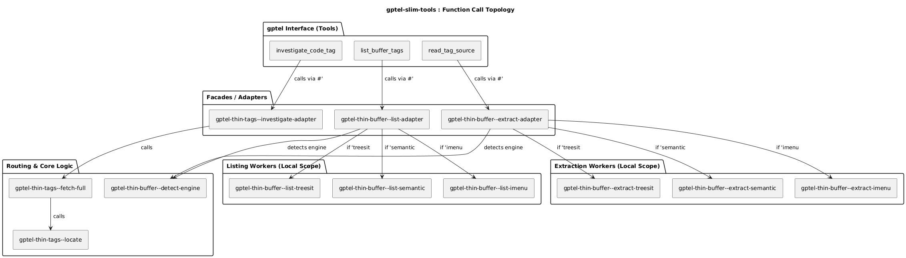
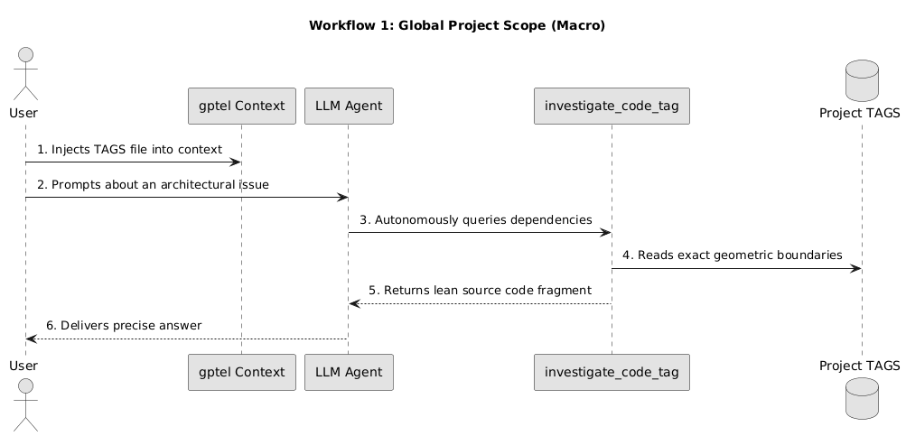
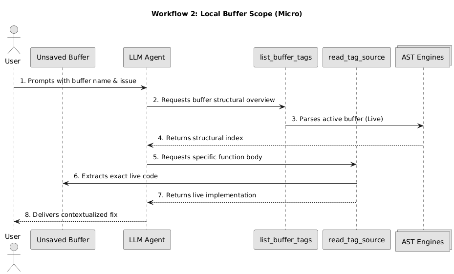
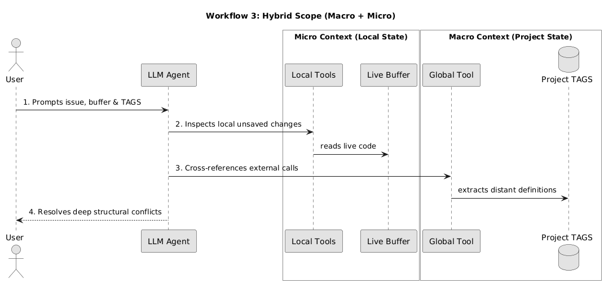
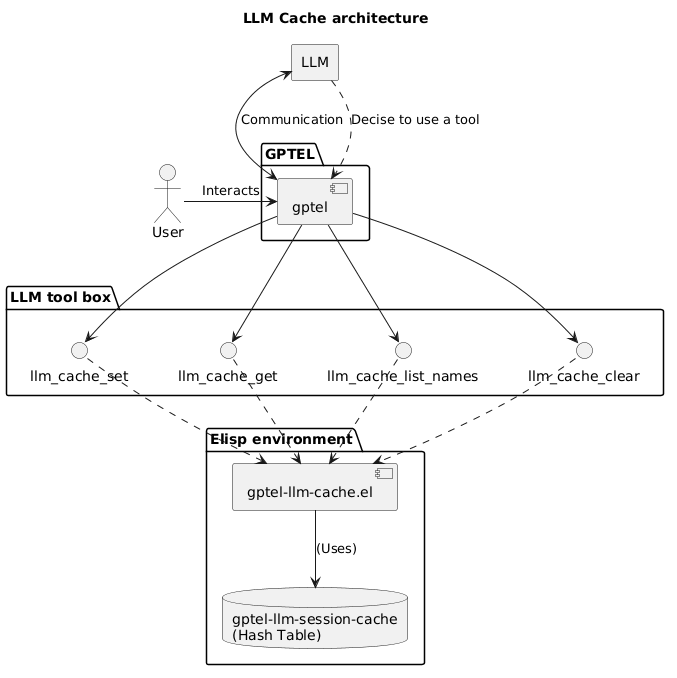
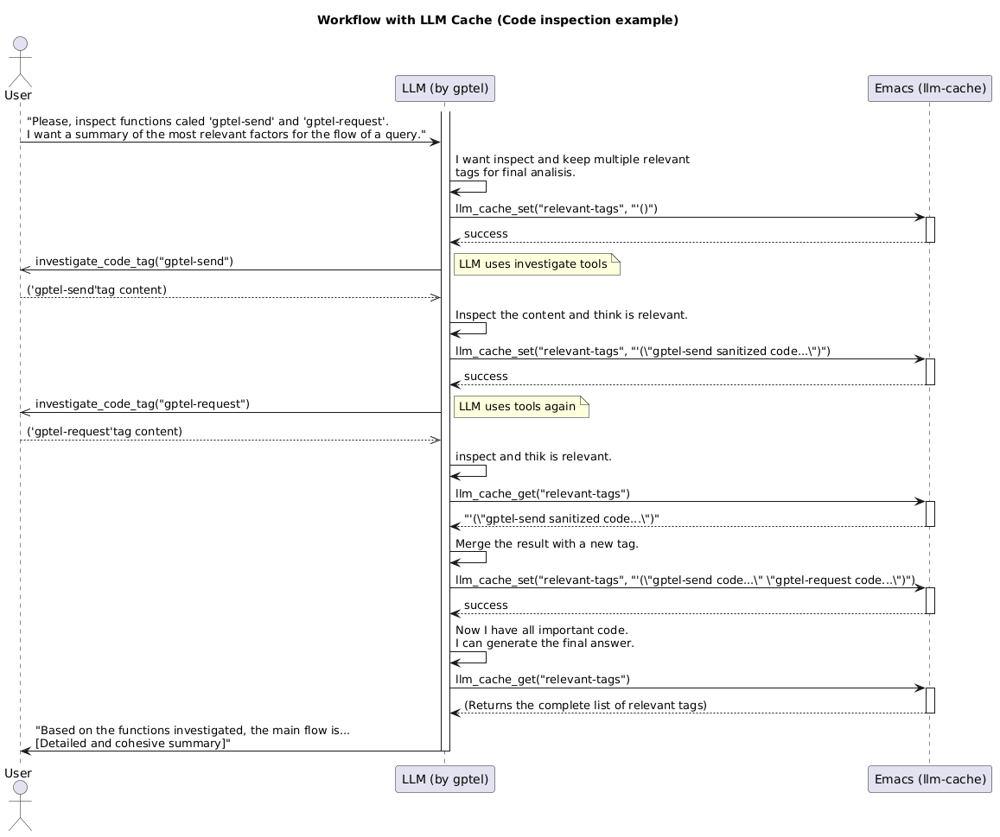

# gptel-slim-tools


A collection of minimal, robust, and high-performance utilities designed to extend [gptel](https://github.com/karthink/gptel). Guided by a KISS (Keep It Simple, Stupid) and Suckless philosophy, these tools transform the Large Language Model (LLM) from a passive text-completion engine into an active, autonomous investigator (Agentic AI).

By providing **Lean Context Generation** and an **LLM-Managed Session Cache**, `gptel-slim-tools` empowers the LLM to efficiently navigate codebases, retrieve strictly necessary definitions without polluting the context window, and maintain its own working memory across complex, multi-step tasks.

---

## 🔬 The Philosophy

Feeding entire projects or overly large files to an LLM is highly inefficient, consumes excessive tokens, and frequently leads to hallucinations. Furthermore, LLMs often struggle with context-window limitations during long debugging sessions. This package solves these issues through two core pillars:

1. **Bimodal Lean Context (Code Inspection):** The LLM extracts exactly what it needs, when it needs it.
   - **Global Project Scope:** Uses deterministic extraction on project-wide TAGS files to isolate code fragments with near-zero latency.
   - **Local Buffer Scope:** Dynamically extracts structural metadata and function boundaries directly from active buffers (even unsaved ones).
2. **Ephemeral Working Memory (Session Cache):** Provides the LLM with an in-memory "scrapbook". The LLM can autonomously store, retrieve, and manage arbitrary Elisp data structures to maintain context, cache intermediate results, or organize tasks without bloating the chat history.

---

## 🏗 Core Architecture & Toolset

The package registers seven highly specialized tools directly into the Emacs `gptel` ecosystem. The architecture follows a strict adapter pattern to isolate complex Elisp logic from the simplified interfaces consumed by the LLM.



### Domain 1: Code Investigation Tools
1. **`investigate_code_tag`** (Global Scope): Enables the LLM to autonomously explore external codebase dependencies by requesting specific tags from a standard TAGS file.
2. **`list_buffer_tags`** (Local Scope): Scans the current open buffer and returns a structured list of available definitions (functions, classes, variables).
3. **`read_tag_source`** (Local Scope): Extracts the exact source code of a specific tag directly from the live buffer.

#### Graceful Degradation Engine
For local buffer operations, the extraction engine guarantees high resilience by attempting to parse the source code through a hierarchical fallback mechanism:
- **Tree-sitter (Primary):** Utilizes modern AST parsing for absolute precision (Requires Emacs 29+).
- **Semantic Mode (Secondary):** A robust fallback leveraging Emacs' native Semantic parser.
- **Imenu (Tertiary):** A universal, regular-expression-based fallback capable of handling virtually any major mode.

### Domain 2: LLM-Managed Session Cache
Implemented as a simple hash table within Emacs, this cache allows the LLM to manage its own state.
4. **`llm_cache_set`**: Stores or updates an Elisp data object (as a string) in the cache.
5. **`llm_cache_get`**: Retrieves a data object from the cache using its name.
6. **`llm_cache_list_names`**: Returns a list of all names (keys) currently stored, allowing the LLM to inspect its own memory.
7. **`llm_cache_clear`**: Removes a specific data object or clears the entire cache.

---

## 🛠 Workflow Strategies

The tools are designed to be used in distinct workflow paradigms depending on the complexity of the task.

### Mode 1: Global Project Scope (Macro)
**Use Case:** Understanding architecture or debugging issues involving multiple external files.
**Execution:** The project's root TAGS file is added to the gptel context. The LLM uses `investigate_code_tag` to chase dependencies. Ephemeral buffers (`*gptel-context:...*`) are created silently and automatically destroyed by a garbage collector hooked into `gptel-post-response-functions`.



### Mode 2: Local Buffer Scope (Micro / On-the-fly)
**Use Case:** Writing a new feature in an unsaved file and requiring immediate assistance with a local function.
**Execution:** The LLM uses `list_buffer_tags` to map the file and `read_tag_source` to read the exact, uncommitted implementation.



### Mode 3: Hybrid Scope (Macro + Micro)
**Use Case:** Resolving deep structural conflicts between unsaved local changes and external core infrastructure.
**Execution:** Both local tools and the global TAGS tool are enabled, allowing cross-referencing with minimal token usage.



### Mode 4: Stateful Agentic Workflow (Cache)
**Use Case:** The LLM performs a multi-step refactoring or debugging session where it needs to remember a list of affected files, relevant tags, or intermediate summaries.
**Execution:** The LLM uses `llm_cache_set` to save findings (e.g., a list of tags). In subsequent turns, it uses `llm_cache_get` to recall this data, preventing the need to re-scan buffers or re-read TAGS files.

**Cache Architecture:**


**Typical Cache Interaction:**


---

## 📖 TAGS Generation Guide (For Global Scope)

To utilize `investigate_code_tag`, an Emacs-compatible TAGS file must be maintained at the project root.

### Primary Method: Native `etags` (Standard)
```bash
# General recursive generation
find . -type f -not -path '*/.*' | xargs etags -a

# Language-specific examples (e.g., C/C++)
find . -type f \( -name "*.c" -o -name "*.cpp" -o -name "*.h" \) -exec etags -a {} +
```

### Secondary Method: Universal Ctags
The `-e` flag is **mandatory** for Emacs compatibility.
```bash
ctags -e -R -f TAGS .
``` 

---

## 🔧 Installation

### Prerequisites
- Emacs 28.1 or higher (Emacs 29+ recommended for Tree-sitter support).
- [gptel](https://github.com/karthink/gptel) installed and configured.

### Method 1: Quick Evaluation (Development / Testing)
Clone the repository and load the files directly into the running Emacs session.
```bash
cd ~/src
git clone https://github.com/jeremias-a-queiroz/emacs-gptel-slim-tools.git
``` 
In Emacs, evaluate:
```elisp
(load "~/src/emacs-gptel-slim-tools/gptel-thin-buffer.el")
(load "~/src/emacs-gptel-slim-tools/gptel-thin-tags.el")
(load "~/src/emacs-gptel-slim-tools/gptel-llm-cache.el")
``` 

### Method 2: Permanent Setup
Move or clone the repository into your personal Emacs Lisp directory (`~/.emacs.d/lisp/` or `~/.config/emacs/lisp/`).
```elisp
(add-to-list 'load-path (expand-file-name "~/.emacs.d/lisp/emacs-gptel-slim-tools"))

(require 'gptel-thin-buffer)
(require 'gptel-thin-tags)
(require 'gptel-llm-cache)
```

---

## 💡 Suggested LLM System Prompt

To maximize the autonomy and efficiency of the LLM, it is highly recommended to provide a clear system prompt detailing how it should utilize the tools:

> *"You are an expert developer assistant operating within Emacs. To understand the local file structure, use `list_buffer_tags` on the active buffer. If you need to read the exact, unsaved implementation of a local function, use `read_tag_source`. If the code references an external dependency belonging to this project, use `investigate_code_tag` along with the project's TAGS file to autonomously extract its full definition. Do not guess or hallucinate code implementations.*
> 
> *Furthermore, you have access to an ephemeral session cache. If you need to remember intermediate results, lists of relevant tags, or complex state across multiple interactions, use `llm_cache_set` to store this data and `llm_cache_get` to retrieve it later. Manage your own memory to stay efficient."*

---

## ⚖ License

This software is licensed under the **GPLv3 License**.

*"Simplicity is the soul of efficiency."*
